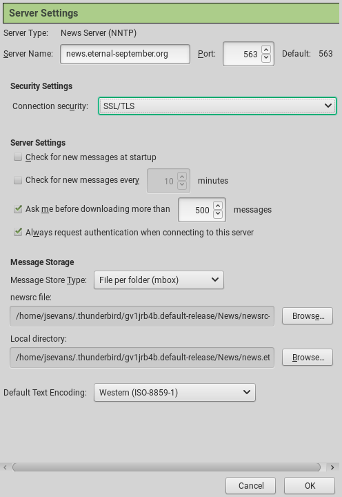

Getting Started with Usenet
===========================
:Author:    Jason Evans
:Email:     jsevans@big-8.org
:Date:      22 June 2020
:Revision:  1.0

== Introduction:
A lot of online tutorials talk about how to use Usenet for Piracy but very few talk about Usenet's true legacy. Usenet is the original way to talk have long form discussions on the internet. It's use diminished over time as new forums such as Facebook and Twitter came around but it never became useless. Usenet's greatest strength comes from the fact that it is completely decentralized. If every Usenet server except one were to go down, that wouldn't be the end of Usenet. However if Facebook is down, then it's down for everyone and when it's gone, it will probably be gone forever.

Usenet is simple. It is based on plain text, but it's no more difficult to use than email.

== Task 1: *Get a Usenet Account*

. Open your browser and go to the following website:
+
http://www.eternal-september.org/RegisterNewsAccount.php
+
Before you continue, make sure to take a look at the Terms of use. This isn't a bunch of legaleze, but they are guidelines on what is permitted. It's OK if you don't understand everything but most people will get the gist of what's being said.
+
http://www.eternal-september.org/index.php?showpage=terms
. Fill out the information in the form. The server will send a new email in *plain text*. No, this is not ideal, but you can always come back and change the password later. Always use a new password when signing up to a new website so it can't be used elsewhere if it is found.
. Put your userid and password someplace safe. You will also need to know that the server address that you will be using is:
+
news.eternal-september.org

== Task 2: Set up *Thunderbird*

. Install Thunderbird if you haven't already. If you are using Windows or Mac, you can install it from the following URL, if you are using Linux, you can install it with your distribution's package manager:
+
https://www.thunderbird.net/en-US/thunderbird/all/
. The first time that you run Thunderbird, you will be prompted with a screen that says, “Set Up an Existing Email Account”. Click the *Cancel* button to continue. You can use Thunderbird for email also if you want,
but we will focus on Usenet:
. Click on *Newsgroups*:
. Fill in Your Name and Email Address, then click *Next*:

image::account_wizard.png[]

These do *not* have to be real. You can make as many profiles as you want. Each profile is called a Nym in Usenet terminology. If you want people to be able to communicate with you outside of Usenet, then it may be good to invest the time to create a spare email account.
. Fill in your Newsgroup Server:

----
news.eternal-september.org
----
. Choose an Account Name or leave it as the default
. Click *Finish*:
. Click on *View Settings for this account*:
. Click on *Server Settings*

image::view_settings.png[]

. Change Security Settings to *SSL/TLS*:
. Click on *Always request authentication when connecting to this server*
. Click *OK* at the bottom of the window:

. Click Click *Manage newsgroup subscriptions*:
. Fill in your userid and password for eternal-september and click save
password if you want:
+
If you are not using eternal-september, use the information from your
Usenet provider.

== Task 3: *Subscribe to your first newsgroups*

. In the search window, search for eternal-september. The news server contains a few newsgroups that are not accessible to other providers. These all begin with “eternal-september.*”:
. Click on the box next to *eternal-september.test* or click *Subscribe* then *OK*.

. Click on the Arrow next to *news.eternal-september.org* on the left:
+
Thunderbird always minimizes the names of newsgroups to save space.
. Click on the first newsgroup which is *eternal-september.test*:
+
You will be prompted for how many headers to download. If you have a very slow connection, you can just download a few. That's not a restriction that many people still have.
+
You should now see a lot of nonsense articles. These are articles from people who are doing exactly what you are doing. They are testing out their newsreaders to make sure that they can post to Usenet.
. Click on a few articles from other people and read them. Don't expect them to make any sense since this is a test newsgroup. It's good to understand what a newsgroup article looks like like. +

== Task 4: *Post your first newsgroup article*

. On the menu bar, click on *Write*:
. Write a simple title and message.
. On the menu, click *Send*:

image::new_message.png[]

== Summary:

In this tutorial, you have signed up for your first Usenet account, set up Thunderbird for Usenet, read a few article, and posted a test article. You now have all of the tools to be dangerous.

A word about Usenet Netiquette:

Before there were Codes of Conduct, there was Netiquette. Netiquette is a set of common sense rules for behaving online. Most are common sense: don't be a jerk to people, don't troll, don't feed the trolls, and don't spam.
Others are specific to Newsgroups such as don't top post. You can read about this in a little more detail below. Nobody wants to join a new community and be __that newbie__. It's always best to read first, reply
later.

http://linux.sgms-centre.com/misc/netiquette.php

(End of Exercise)
